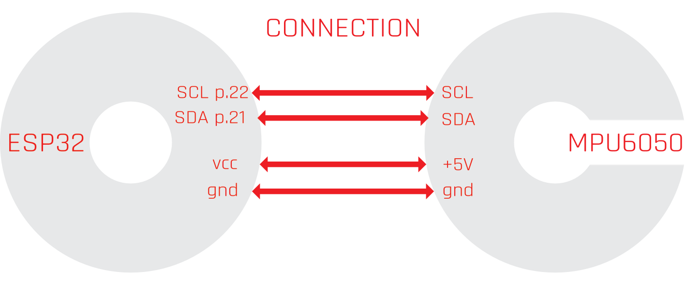

# OSC-Accelerometer WiFi

Accelerometer wifi made with Esp32, is a controller wifi for OSC message

# Features
- WiFI,OSC interfaces
- No extra drivers to connect Windows, macOS, iOS (iPad/iPhone) and Android
- IEEE 802.11 b/g/n Wi-Fi 2.4 GHZ with AutoConnection
- Bonjour connection
- Smart Config technology to help users connect to a Wi-Fi network through simple app on a smartphone or Computer.

# Material

- ESP32 board
- MPU6050 accelerometer

# Connect

- Wi-Fi Station "ESP-Accel" password "12345678"
- Bonjour connection "ESP-Accel"
- Port OUT "8000"
- Port IN "9000"

# OSC Message 

- /ax        (accelerometer X)
- /ay        (accelerometer Y)
- /az        (accelerometer Z)
- /gx        (GyroX)
- /gy        (GyroY)
- /gz        (GyroZ)

# OSC library

https://github.com/CNMAT/OSC
